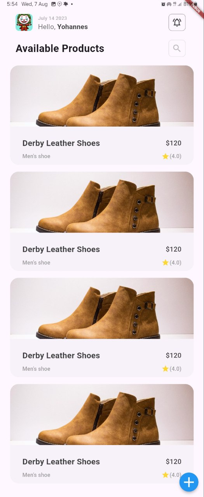
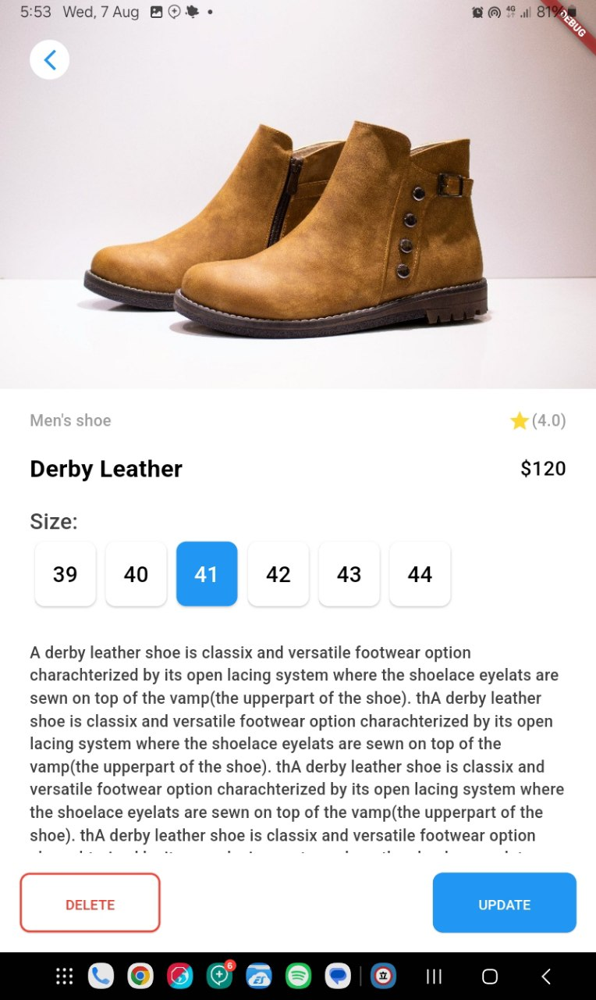
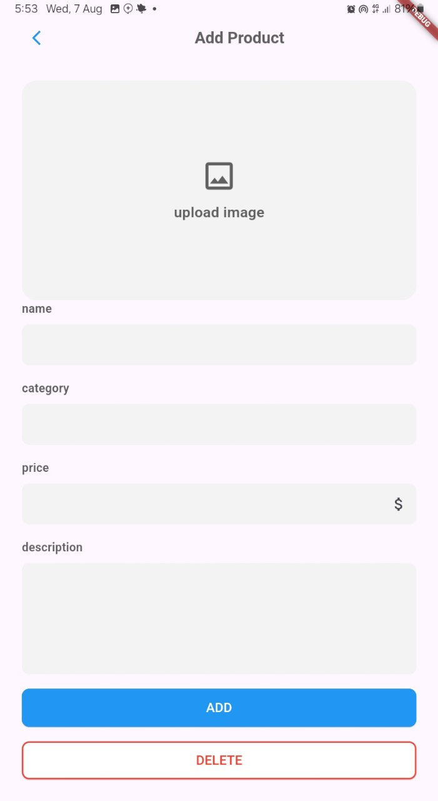
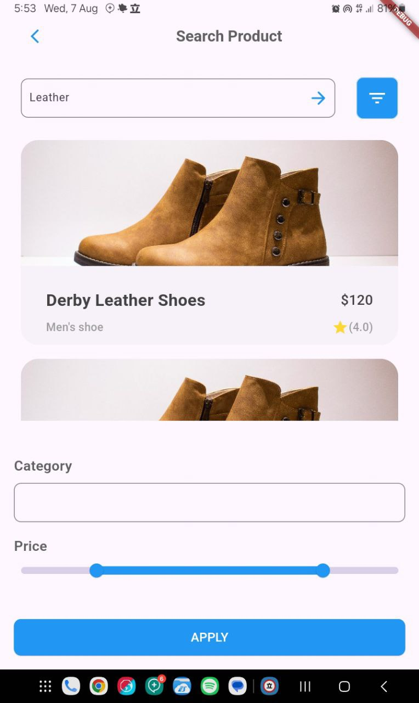

# Project Title

Task 6: Implementing a Flutter User Interface

## Objective:

Create a Flutter user interface that replicates the design of a provided picture.

## Screenshots

Below are some screenshots of the project:

### Screen One

### Screen Two

### Screen Three

### Screen Four

